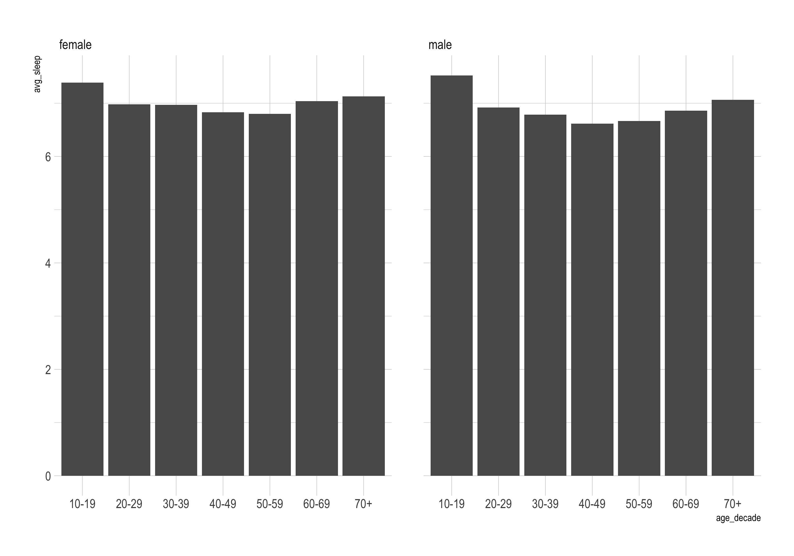

```{r setup, include=FALSE}
knitr::opts_chunk$set(echo = TRUE)
```

# Load Packages

Let's load the `tidyverse` package. 

```{r}
library(tidyverse)
```

# Import NHANES Data

Import your data into a data frame called NHANES. 

```{r}
# YOUR CODE HERE 
```


# Scatterplot

Make a scatterplot that shows weight on the x axis and height on the y axis.

```{r}
# YOUR CODE HERE 
```


# Histogram 

Make a histogram that shows the distribution of the weight variable.


```{r}
# YOUR CODE HERE 
```

Copy your code from above, but adjust it so that there are 50 bins.

```{r}
# YOUR CODE HERE 
```

# Bar Chart

## Bar Chart v1

Use the v1 approach to make a bar chart that shows a count of the number of people who say they smoke. Include NA responses.


```{r}
# YOUR CODE HERE 
```


## Bar Chart v2

I've made a new data frame called `sleep_by_gender` that shows the average amount of sleep per night that males and females report getting. 

```{r}
sleep_by_gender <- nhanes %>% 
  group_by(gender) %>% 
  summarize(avg_sleep = mean(sleep_hrs_night, na.rm = TRUE)) 
```

Plot the average amount of sleep per night for males and females.

```{r}
# YOUR CODE HERE 
```


# `color` and `fill`

Take your graph from above and make the inside of each bar a different color.

```{r}
# YOUR CODE HERE 
```

Make your scatterplot from before that shows weight on the x axis and height on the y axis again, but make the dots show up in different colors based on the `phys_active` variable.

```{r}
# YOUR CODE HERE 
```


# Scales

## color

Take your scatterplot that you just made and add a scale using `scale_color_viridis_d`. 

```{r}
# YOUR CODE HERE
```

Do nearly the same thing to change the color of the last bar chart you made (the one about sleep and gender). You will have to use `scale_fill_viridis_d`. 

```{r}
# YOUR CODE HERE 
```


# Plot Labels

Use the code chunk from above and do the following:

1. Add a title
2. Add a better y axis label
3. Remove the x axis label

```{r}
# YOUR CODE HERE 
```


# Themes

Load the [`hrbrthemes` package](https://hrbrmstr.github.io/hrbrthemes/index.html). It's a package that provides some great default themes. I've installed it for you so you just need to load it.


```{r}
library(hrbrthemes)
```

Then add the `theme_ipsum` to your plot.

```{r}
# YOUR CODE HERE 
```

# Facets

I've created a data frame called `sleep_by_gender_by_age` for you. Run the code chunk below to load the data frame and take a look at it.

```{r}
sleep_by_gender_by_age <- nhanes %>% 
  group_by(gender, age_decade) %>% 
  summarize(avg_sleep = mean(sleep_hrs_night, na.rm = TRUE)) %>% 
  drop_na()
```

Now, see if you can recreate this plot using `facet_wrap` (you can also open it from the plots directory to see it better):



```{r}
# YOUR CODE HERE 
```


# Save Plots

Save your last plot to a PNG that is 8 inches wide and 5 inches high. Put it in the plots directory and call it "my-sleep-plot.png"


```{r}
# YOUR CODE HERE 
```


