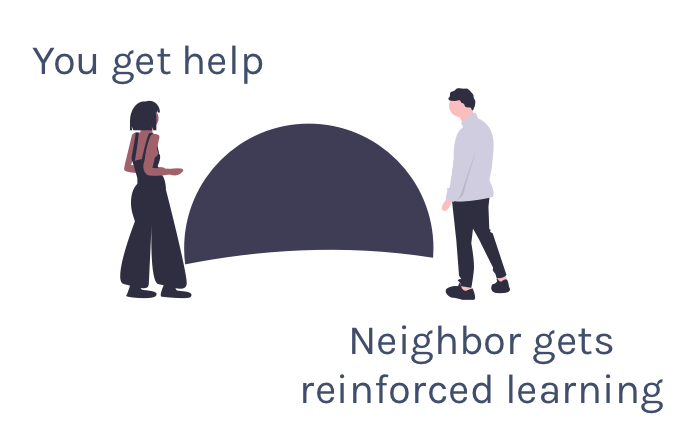

```{r child = "setup.Rmd"}
```


```{r packages, include = F, eval = T}
library(tidyverse)
library(skimr)
library(janitor)
library(DT)
library(here)
library(kableExtra)
library(knitr)
```

class: center, middle, inverse, dk-section-title

# Introductions

---

# Introductions

1. Name 

--

1. Organization

--

1. Why you want to learn R

--

1. Share a **boring** fact about yourself


---

# Agenda

1. Logistics

--

1. Getting Started with R

--

1. RMarkdown

--

1. Break

--

1. Data Wrangling and Analysis

--

1. Data Visualization

---

class: center, middle, inverse, dk-section-title

# Logistics


---

## Sticky Notes

.pull-left[
<div class="sticky-good">
I'm good
</div>
]


.pull-right[
<div class="sticky-stuck">
I'm stuck
</div>
]

---

## Stuck? Talk With a Neighbor

--

.center[

]

---


## This is Hard and That's Ok

--

<p class="large">It’s easy when you start out programming to get really frustrated and think, “Oh it’s me, I’m really stupid,” or, “I’m not made out to program.”</p> 

--

<p class="large">But, that is absolutely not the case. Everyone gets frustrated. I still get frustrated occasionally when writing R code. It’s just a natural part of programming. So, it happens to everyone and gets less and less over time.</p>

--

<p class="large">Don’t blame yourself. Just take a break, do something fun, and then come back and try again later.</p>

---

class: center, middle, dk-section-title

background-image: url("images/hadley-wickham.jpg")

???
Source: (https://r-posts.com/advice-to-young-and-old-programmers-a-conversation-with-hadley-wickham/) 

---


class: center, middle, dk-section-title

background-image: url("images/installation.jpeg")

# Installation

---

## Install R

The first thing you need to do is download the R software. Go to the [Comprehensive R Archive Network (aka “CRAN”) website](https://cran.cnr.berkeley.edu/) and download the software for your operating system (Windows, Mac, or Linux).


---


## RStudio

.center[


.small[Courtesy [Modern Dive](http://moderndive.com/2-getting-started.html#what-are-r-and-rstudio)]
]


---

### Download RStudio

Download RStudio at the [RStudio website](https://www.rstudio.com/products/rstudio/download/#download). Ignore the various versions listed there. All you need is the latest version of RStudio Desktop.


---


## RStudio Cloud


---

### Tour of RStudio

.center[

]

---


class: inverse

### Download Course Project

This is only if, for some reason, someone can't get RStudio Cloud working.

--

Enter the following into the console pane:

```{r eval = F}
install.packages("usethis")
library(usethis)
use_course("https://rfortherestofus.com/workshop-materials/")
```


---

class: center, middle, dk-section-title

background-image: url("images/projects.jpeg")

# Projects

---

## Projects

--

Projects allow you to keep a collection of files all together, including: 

--

- R scripts

--

- RMarkdown files (more on those soon)

--

- Data files

--

- And much more!


---

### Sample Project

.center[

]

---


class: center, middle, dk-section-title

background-image: url("images/files.jpg")
opacity: 0.5

# Files in R

---


## File Types

There are **two main file types** that you'll work with: 

.pull-left[
**R scripts (.R)**

Text is assumed to be executable R code unless you comment it (more on this soon)

```{r}

# This is a comment

data <- read_csv("data.csv")

```
]

--

.pull-right[

**RMarkdown files (.Rmd)**

Text is assumed to be text unless you put it in a code chunk (more on this soon)


]


---

## R Scripts


Create new script file: File -> New File -> R Script


---


## How to Run Code

Run the code: control + enter on Windows,  command + enter on Mac keystrokes or use Run button


???

Note that you don't have to highlight code. 

You can just hit run anywhere on line to run code. 

---

## Comments

Do them for others, and for your future self. 

```{r eval = F}

# Show the first 5 rows of my data

head(data, n = 5)

```

---
class: center, middle, dk-section-title

background-image: url("images/packages.jpg")

# Packages

---

## Packages

Packages add functionality that is not present in base R. 

They're where much of the power of R is found.

--

.center[


.small[Courtesy [Modern Dive](http://moderndive.com/2-getting-started.html#packages)]
]


---

## Packages We'll Use

.pull-left[

.center[

]

]


.pull-right[

### `tidyverse`

The [`tidyverse`](https://tidyverse.org/) is a collection of packages. 

We'll use [`readr`](https://readr.tidyverse.org/) to import data. 

]

---

## Packages We'll Use


.pull-left[

### `skimr`

[`skimr`](https://github.com/ropensci/skimr) provides easy summary statistics.

]


.pull-right[

.center[

]


]

---


## Install Packages

The syntax to install packages is as follows. 

```{r eval=F}
install.packages("tidyverse")
install.packages("skimr")
```

The package name must be in quotes.

--

.dk-highlight-box[
Packages should be installed **once per computer** (i.e. once you've installed a package, you don't need to do it again on the same computer).
]

---

## Load Packages

To load packages, use the following syntax:

```{r eval = T}
library(tidyverse)
library(skimr)
```

Package names don't need to be quoted here (though they can be).

--

.dk-highlight-box[
Packages should be loaded **once per session** (i.e. every time you start working in R, you need to load any packages you want to use). 
]


---


class:inverse

## Your Turn


1. Open the 01-getting-started-exercises.R file

--

1. Install the `tidyverse` and `skimr` packages using the install.packages function

--

1. Load the `tidyverse` and `skimr` packages using the library function

---

class: center, middle, dk-section-title

background-image: url("images/data.jpg")


# Import Data


---

## Import Data

Let's read data from a CSV file. 


```{r eval = T, echo = F}

faketucky <- read_csv(here("data", "faketucky.csv"))


```

```{r}

faketucky <- read_csv("data/faketucky.csv")


```

We now have a data frame/tibble called `faketucky` that we can work with in R.


???

- Tibbles are ["modern data frames"](https://cran.r-project.org/web/packages/tibble/vignettes/tibble.html). The main difference for our purposes is that tibbles print much more nicely within R. 

- We'll use the terms tibble and data frame interchangeably. 

- For Excel files, try `read_excel` from the `readxl` package. 

- For SPSS files, try `read_sav` from the `haven` package.


---


## R is Case Sensitive

R is **case sensitive** so choose one of the following for all objects and **be consistent**.
.pull-left[
**Option**

snake_case 

camelCase

periods.in.names
]

--

.pull-right[

**Example**

student_data

studentData

student.data
]


---


## Directories

If the data file is in the working directory, you only need to specify its name.

```{r}
faketucky <- read_csv("faketucky.csv")
```

--

If the data file is not in the working directory, you need to specify full path name.

```{r}
faketucky <- read_csv("data/faketucky.csv")
```

--

.dk-highlight-box[
*Using an RStudio project sets your working directory to the folder where your project lives so you only need to specify the location relative to that (i.e. you don't have to type "home/user/davidkeyes/documents/work/r/intro-workshop/data/faketucky.csv")*
]

---

## Where Does our Data Live?

Data we have imported is available in the environment/history pane.

.center[

]

---
class:inverse

## Your Turn

1. Open the 01-getting-started-exercises.R file

--

1. Import the faketucky data into a data frame called `faketucky`.

--

1. Make sure you see `faketucky` in your environment/history pane.

---
class: center, middle, dk-section-title

background-image: url("images/function.jpg")


# Objects and Functions

---

## Objects and Functions

--

> To understand computations in R, two slogans are helpful:

--

> Everything that exists is an **object**, and 

--

> Everything that happens is a **function** call.

--

John Chambers, quoted in [Hadley Wickham's Advanced R](http://adv-r.had.co.nz/Functions.html).


---

## Objects and Functions

.center[]


---

## Assignment Operator

.center[
  
]

--

.dk-highlight-box[
We assign the result of the `read_csv` **function** to the `faketucky` **object***
]

---
class: center, middle, dk-section-title

background-image: url("images/glasses.jpeg")


# Examine Our Data


---

## Examine Our Data

There are many ways to look at our data. We'll talk about a few.


---

## `faketucky`

If you type the name of your data frame (i.e. `faketucky`), R will output the following: 
```{r}
faketucky
```

--

```{r eval = T, paged.print = F, echo = F}
faketucky
```


---

## RStudio Viewer

Click on a data frame in the environment pane to open it


---


## `skimr`

The skimr package provides more detailed information about our data frame. It is also broken up by the type of variable.

```{r}

skim(faketucky)

```

--

```{r eval = T, paged.print = F, echo = F}

skim(faketucky)

```

---

class:inverse

## Your Turn

1. Open the file 01-getting-started-exercises.R

--

1. Follow the instructions to examine your data.

---

class: center, middle, dk-section-title

background-image: url("images/issues.jpeg")

# We've Got Issues!

---

## We've Got Issues!

Several variables have max values of 999. This seems suspicious!


---

## We've Got Issues!

Several variables show up as numeric, but we know they're **not actually numeric**.


---

## Let's Import Our Data Again

We need to do two things:


--

1. Tell `read_csv` how to handle **missing data**

--

1. Make sure `read_csv` assigns the correct **data type** to each variable


---


## Missing Data

Here's how we imported our data the first time:

```{r}
faketucky <- read_csv("data/faketucky.csv")
```

--

To tell R which data is missing, simply add an argument to the `read_csv` function as follows:

```{r}
faketucky <- read_csv("data/faketucky.csv",
                     na = "999") #<<
```

```{r eval = T, echo = F}
faketucky <- read_csv(here("data", "faketucky.csv"),
                      na = "999") 

```


---

## Missing Data

If we skim our data again, we'll see that there are no longer 999 values. 

```{r}
skim(faketucky)

```

???

Do this in R


---

## Data Types

When you run `read_csv` you'll see the following message, which tells you the data types that have been assigned to your data frame.

--


```{r}
Parsed with column specification:
cols(
  student_id = col_double(),
  first_high_school_attended = col_character(),
  school_district = col_character(),
  male = col_double(),
  race_ethnicity = col_character(),
  free_and_reduced_lunch = col_double(),
  percent_absent = col_double(),
  gpa = col_double(),
  act_reading_score = col_double(),
  act_math_score = col_double(),
  received_high_school_diploma = col_double(),
  enrolled_in_college = col_double()
)
```

---

## Data Types


- **Double/Numeric** (e.g. 2.5)

--

- **Character** (e.g. "Male")

--

There are [many other data types in R](https://www.statmethods.net/input/datatypes.html) that we won't discuss in this course.

---

## Data Types

```{r eval = T, echo = F}

faketucky <- read_csv(here("data/faketucky.csv"),
                     na = "999",
                     col_types = list(enrolled_in_college = col_character(), 
                                      free_and_reduced_lunch = col_character(), 
                                      male = col_character(),
                                      received_high_school_diploma = col_character())) 


```

```{r}

faketucky <- read_csv("data/faketucky.csv",
                     na = "999",
                     col_types = list(enrolled_in_college = col_character(), #<<
                                      free_and_reduced_lunch = col_character(), #<<
                                      male = col_character(), #<<
                                      received_high_school_diploma = col_character())) #<<


```


---


class:inverse

## Your Turn

Open the file exercises.R and change the code so that you correctly import the `faketucky` data frame, telling `read_csv` which data is missing and explictly defining column types where necessary.

```{r}
faketucky <- read_csv(here("data/faketucky.csv"),
                     na = "TEXTYOUWANTTOBENA",
                     col_types = list(VARIABLE1 = col_character(),
                                      VARIABLE2 = col_character()))
```


--

After you make changes to how you import your data, rerun the code in the Examine Data section to make sure everything worked!

---


class: center, middle, dk-section-title

background-image: url("images/help.jpeg")

# Getting Help

---

### ?function

Use the ? to get help about anything you're confused about

```{r}

?read_csv

```

---

## Tidyverse Website

[](https://www.tidyverse.org/)

---


## Package Vignettes

[](https://cran.r-project.org/web/packages/skimr/vignettes/Using_skimr.html)


